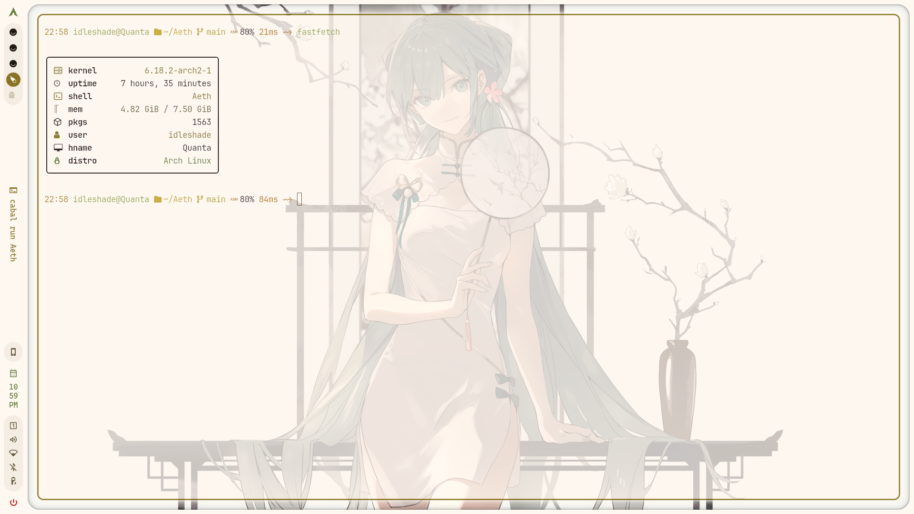

  <pre><samp>
 ______            _     _          ______                        
(_____ \          | |   (_)        (_____ \             _         
 _____) )___ _____| |__  _ ____     _____) )____ ____ _| |_ _____ 
|  ____/ ___|____ |  _ \| |  _ \   |  ____(____ |  _ (_   _|____ |
| |   | |   / ___ | |_) ) | | | |  | |    / ___ | | | || |_/ ___ |
|_|   |_|   \_____|____/|_|_| |_|  |_|    \_____|_| |_| \__)_____|
                                                                  
  +-------------------+
  |   PRABIN  PANTA   |
  +-------------------+
  120 162 141 142 151 156  120 141 156 164 141 
  </samp></pre>
  
<strong>BSc(hons.) Computer Systems Engineering</strong> @ ISMT College (University of Sunderland) • Big Data • NLP • Machine Learning

  

    
  

  

  
    
    
  

  

  <a href="#about-me">About</a> •
  <a href="#tools-and-technologies">Tools & Technologies</a> •
  <a href="#skills">Skills</a> •
  <a href="#github-stats">Stats</a> •
  <a href="#connect-with-me">Connect</a>
  

  

---

<samp>┄┄┄┄┄ ✎ ┄┄┄┄┄┄┄┄┄┄</samp>

<h3 id="about-me">👋 About Me</h3>

<samp>// learn • build • iterate</samp>

- BSc(hons.) Computer Systems Engineering @ <em>ISMT College</em> (University of Sunderland)
- Interests: <strong>Machine Learning</strong>, <strong>NLP</strong>, <strong>Data Engineering</strong>
- I build: data pipelines, ML prototypes, and small automations
- Exploring: <strong>Nix</strong>, <strong>OpenResty/Lua</strong>, <strong>LLM tooling</strong>
- Linux‑first workflows (Arch). Minimal, reproducible, and scriptable
- Open to collaborations in AI/ML, automation, and tooling

---

<samp>┄┄┄┄┄ ✎ ┄┄┄┄┄┄┄┄┄┄</samp>

<h3 id="tools-and-technologies">🧰 Tools & Technologies</h3>

- scikit-learn, XGBoost, Keras, Python
- React, Typescript, Js
- Nix, OpenResty, Nginx, Lua
- PostgreSQL, SQLite, Mongodb
- Linux, Git & Github
- Android Studio, AI tools
- Gradio, streamlit, Plantuml, mermaid

---

<samp>┄┄┄┄┄ ✎ ┄┄┄┄┄┄┄┄┄┄</samp>

<h3 id="skills">🧠 Skills</h3>

- AI/ML
- Data preprocessing and visualization
- Logic Simulation & Truth Tables
- Python Programming
- Debugging
- Problem-Solving & Self-Learning

---

<samp>┄┄┄┄┄ ✎ ┄┄┄┄┄┄┄┄┄┄</samp>

<h3 id="github-stats">📊 GitHub Stats</h3>

  
Open to view

  <table>
    <tr>
      <td>
        <picture>
          <source media="(prefers-color-scheme: dark)" srcset="http://github-profile-summary-cards.vercel.app/api/cards/stats?username=prabinpanta0&theme=zenburn" />
          <source media="(prefers-color-scheme: light)" srcset="http://github-profile-summary-cards.vercel.app/api/cards/stats?username=prabinpanta0&theme=zenburn" />
          
        </picture>
      </td>
      <td>
        <picture>
          <source media="(prefers-color-scheme: dark)" srcset="https://streak-stats.demolab.com/?user=%22prabinpanta0%22" />
          <source media="(prefers-color-scheme: light)" srcset="https://streak-stats.demolab.com/?user=%22prabinpanta0%22" />
          
        </picture>
      </td>
    </tr>
    <tr>
      <td>
        <picture>
          <source media="(prefers-color-scheme: dark)" srcset="http://github-profile-summary-cards.vercel.app/api/cards/repos-per-language?username=prabinpanta0&langs_count=8&theme=zenburn" />
          <source media="(prefers-color-scheme: light)" srcset="http://github-profile-summary-cards.vercel.app/api/cards/repos-per-language?username=prabinpanta0&langs_count=8&theme=zenburn" />
          
        </picture>
      </td>
      <td>
        <picture>
          <source media="(prefers-color-scheme: dark)" srcset="http://github-profile-summary-cards.vercel.app/api/cards/most-commit-language?username=prabinpanta0&layout=compact&langs_count=8&theme=github_dark&hide_border=false" />
          <source media="(prefers-color-scheme: light)" srcset="http://github-profile-summary-cards.vercel.app/api/cards/most-commit-language?username=prabinpanta0&layout=compact&langs_count=8&theme=default&hide_border=false" />
          
        </picture>
      </td>
    </tr>
    <tr>
      <td>
        <picture>
          <source media="(prefers-color-scheme: dark)" srcset="https://github-profile-summary-cards.vercel.app/api/cards/productive-time?username=prabinpanta0&theme=github_dark&utcOffset=5.45" />
          <source media="(prefers-color-scheme: light)" srcset="https://github-profile-summary-cards.vercel.app/api/cards/productive-time?username=prabinpanta0&theme=github&utcOffset=5.45" />
          
        </picture>
      </td>
      <td>
        <picture>
          <source media="(prefers-color-scheme: dark)" srcset="http://github-profile-summary-cards.vercel.app/api/cards/stats?username=prabinpanta0&theme=zenburn" />
          <source media="(prefers-color-scheme: light)" srcset="http://github-profile-summary-cards.vercel.app/api/cards/stats?username=prabinpanta0&theme=zenburn" />
          
        </picture>
      </td>
    </tr>
  </table>

  

---

<samp>┄┄┄┄┄ ✎ ┄┄┄┄┄┄┄┄┄┄</samp>

<h3 id="achievements">🏆 Achievements</h3>

  
GitHub Trophies

  <picture>
    <source media="(prefers-color-scheme: dark)" srcset="https://github-trophies.vercel.app/?username=prabinpanta0&theme=radical&no-frame=true&no-bg=true&margin-w=5" />
    <source media="(prefers-color-scheme: light)" srcset="https://github-trophies.vercel.app/?username=prabinpanta0&theme=radical&no-frame=true&no-bg=true&margin-w=5" />
    
  </picture>

---

<samp>┄┄┄┄┄ ✎ ┄┄┄┄┄┄┄┄┄┄</samp>

<h3 id="activity">📈 Activity</h3>

  
Recent Activity Graph

  <a href="https://github.com/prabinpanta0">
    <picture>
      <source media="(prefers-color-scheme: dark)" srcset="https://github-readme-activity-graph.vercel.app/graph?username=prabinpanta0&theme=github-dark&area=false" />
      <source media="(prefers-color-scheme: light)" srcset="https://github-readme-activity-graph.vercel.app/graph?username=prabinpanta0&theme=github-compact&area=false" />
      
    </picture>
  </a>

---

<h3 id="connect-with-me">🌐 Connect with Me</h3>

  
  
  
  
  
  

---

Note: Stats cards and graphs are powered by third‑party services and may experience occasional downtime.

