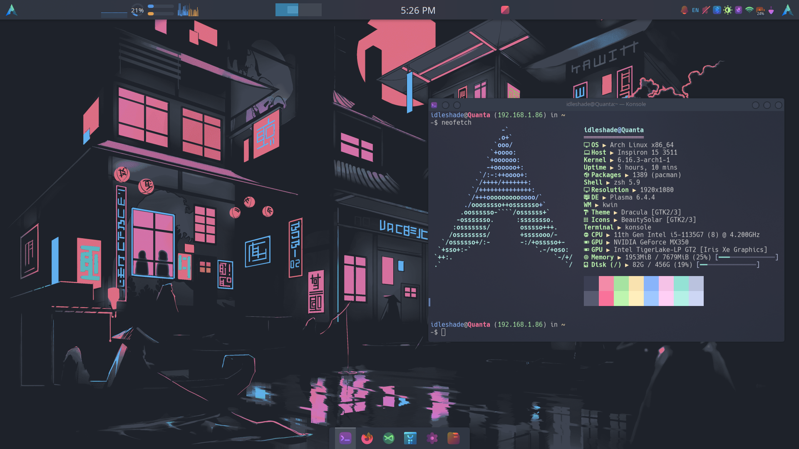

  <pre><samp>
 ______            _     _          ______                        
(_____ \          | |   (_)        (_____ \             _         
 _____) )___ _____| |__  _ ____     _____) )____ ____ _| |_ _____ 
|  ____/ ___|____ |  _ \| |  _ \   |  ____(____ |  _ (_   _|____ |
| |   | |   / ___ | |_) ) | | | |  | |    / ___ | | | || |_/ ___ |
|_|   |_|   \_____|____/|_|_| |_|  |_|    \_____|_| |_| \__)_____|
                                                                  
  +-------------------+
  |   PRABIN  PANTA   |
  +-------------------+
  120 162 141 142 151 156  120 141 156 164 141 
  </samp></pre>

  
<strong>BSc(hons.)Computer Systems Engineering</strong> @ ISMT College (University of Sunderland) • Big Data • NLP • Machine Learning

  

    
  

  

    
    
  

  

    <a href="#about-me">About</a> •
    <a href="#tools--technologies">Tools & Technologies</a> •
    <a href="#skills">Skills</a> •
    <a href="#github-stats">Stats</a> •
    <a href="#connect-with-me">Connect</a>
  

  

---

<samp>┄┄┄┄┄ ✠┄┄┄┄┄┄┄┄┄┄</samp>

### 👋 About Me

- BSc in IT (Computer Systems Engineering) student at <em>ISMT College</em>, affiliated with the <em>University of Sunderland</em>.
- Passionate about <strong>big data analytics</strong>, <strong>natural language processing</strong>, and <strong>machine learning</strong>.
- Comfortable with <strong>C</strong>, <strong>C++</strong>, <strong>C#</strong>, <strong>Python</strong>, <strong>HTML</strong>, <strong>CSS</strong>, and <strong>JavaScript</strong>.
- Hands-on with <strong>Google Cloud Natural Language API</strong>, <strong>Selenium</strong>, <strong>Generative AI</strong>, and <strong>Linux</strong>.
- I enjoy building creative projects, automations, and exploring emerging tech.

---

<samp>┄┄┄┄┄ ✠┄┄┄┄┄┄┄┄┄┄</samp>

### 🧰 Tools & Technologies

- scikit-learn, XGBoost, Keras, Python
- React, Typescript, Js
- Nix, OpenResty, Nginx, Lua
- PostgreSQL, SQLite, Mongodb
- Linux, Git & Github
- Android Studio, AI tools
- Gradio, streamlit, Plantuml, mermaid

---

<samp>┄┄┄┄┄ ✠┄┄┄┄┄┄┄┄┄┄</samp>

### 🧠 Skills

- AI/ML
- Data preprocessing and visualization
- Logic Simulation & Truth Tables
- Python Programming
- Debugging
- Problem-Solving & Self-Learning

---

<samp>┄┄┄┄┄ ✠┄┄┄┄┄┄┄┄┄┄</samp>

### 📊 GitHub Stats

  
Open to view

  |  |  |
  | --- | --- |
  |  |  |

---

<samp>┄┄┄┄┄ ✠┄┄┄┄┄┄┄┄┄┄</samp>

### 🏆 Achievements

  
GitHub Trophies

  

---

<samp>┄┄┄┄┄ ✠┄┄┄┄┄┄┄┄┄┄</samp>

### 📈 Activity

  
Recent Activity Graph

  

---

### 🌐 Connect with Me

  
  
  
  
  
  

---

Note: Stats cards and graphs are powered by third‑party services and may experience occasional downtime.
